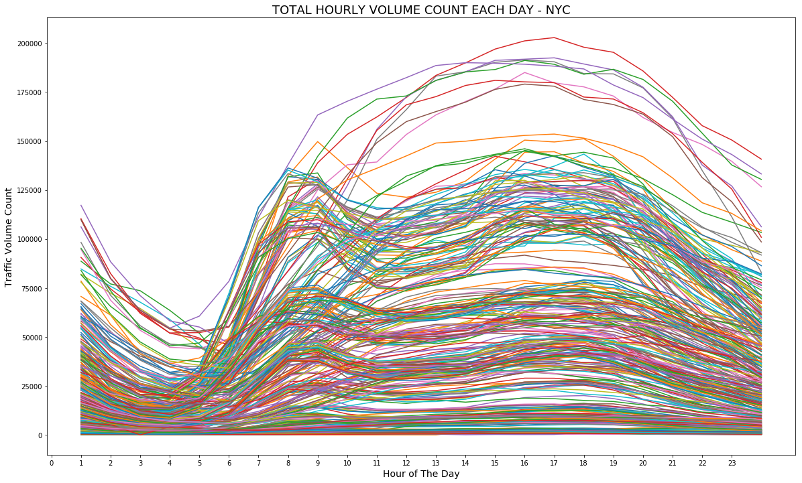

# Predicting_Traffic_Data_Using_Weather

**Motivation:**

New York City is the third most congested city in the world in terms of traffic and the second worst in the United States. https://ny.curbed.com/2018/2/6/16979696/new-york-city-traffic-congestion-second-worst

As a resident, I have always noticed that traffic seemed to be just a bit worse during bad weather conditions and wondered how much (if any) statistically significant impact weather has on traffic. I chose to test this theory by analyzing traffic volume count data set from NYC OPEN Data from 2012-2018 (TONS of MISSING DATA) against daily weather data collected at the Laguardia Airport Station from  www.wunderground.com.

**Null Hypothesis:** Weather does not have statistically significant impact on traffic volume in NYC.

**Hypotehsis:** Weather has statistically significant impact on traffic volume in NYC.

**Test:** Test hypothesis by running a regression of traffic volument data against weather parameters. Fail to reject null hypothesis if the coefficients are statistically significant and the model is reliable.

EDA:

The traffic volume data

**Some Decisions to Simplify the Process:**

1) I decided to narrow down the scope of the project to the times between 6am-8pm. The assumption being that during these hours commuters are most active. As such any effect of weather should be more pronounced during this window.

2) For the scope of the project I also decided to narrow down analysis to the total daily volume for NYC

3) I also disregard hourly data by getting daily volume for a day. So my target or dependent variable will be Total Daily Volume for NYC on a given day

**Feature Engineering:**

Although I am not doing time series analysis due to a lot of missing data. I am aware that time definitely has an effect on traffic. To capture some of these temporal variability I extracted some new categorical features.

`Month_of_year` - Categorical - The numeric ID for the month of the year

`day_of_week` - Categorical - The numeric ID for the day of the week. With Monday= 0 and Sunday =6

`is_weekday` - Categorical - 1 = weekday, 0 = weekend.

**Feature Selection:**

I ran pearson correlations analysis on all of the features and observed the following:

* Total_Daily_Volume and Mean_Daily_Volume have almost identical correlation number with the features.
  * So I picked Total Daily Volume as the target.
* Very small correlation between both total daily volume volume with avg temperature and max temperature.
* Correlation of Volume is higher with Temp_Avg than with Temp_Max.
* No visible correlation of the traffic volume with any other weather components.
  * So I chose Temp_avg as the only weather feature.

**Model:**

My target variable - `Total_Daily_Volume` is a count variable. Count variables usually follow a poisson distribution and the appropriate regression for such a distribution is a  Generalized Linear Model (GLM) called Poisson Regression. However the poisson regression assumes that the variance of the data will be equal to the mean of the distribution. This in our case is not true. Our variance is over 500 times the mean. That is a lot of variation. For these kinds of distribution the next GLM option is to try Negative Binomial Regression (NBR).

Explanations for NLB:
https://dius.com.au/2017/08/03/using-statsmodels-glms-to-model-beverage-consumption/

Data sources:
Traffic Volume: NYC OPEN Data

Weather data:  https://www.wunderground.com/history/monthly/us/ny/new-york-city/KLGA/date/2015-12
